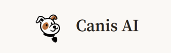
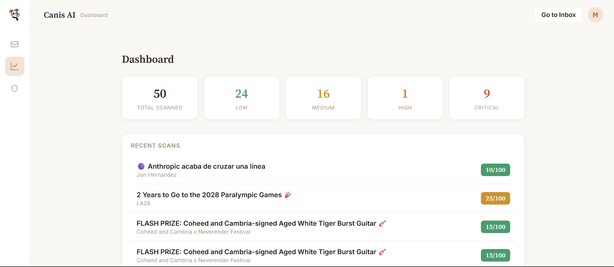
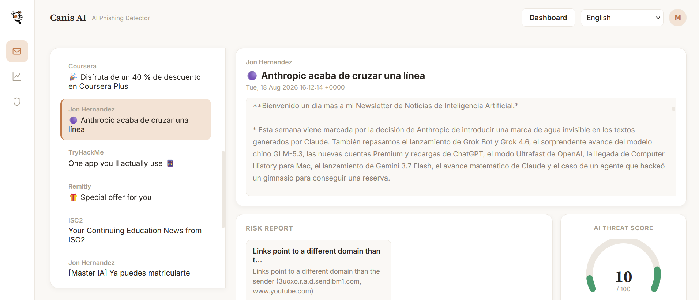
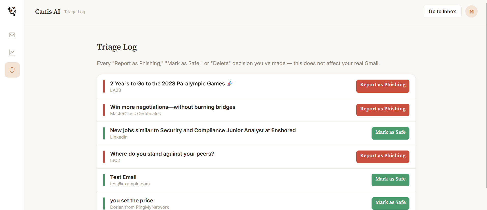
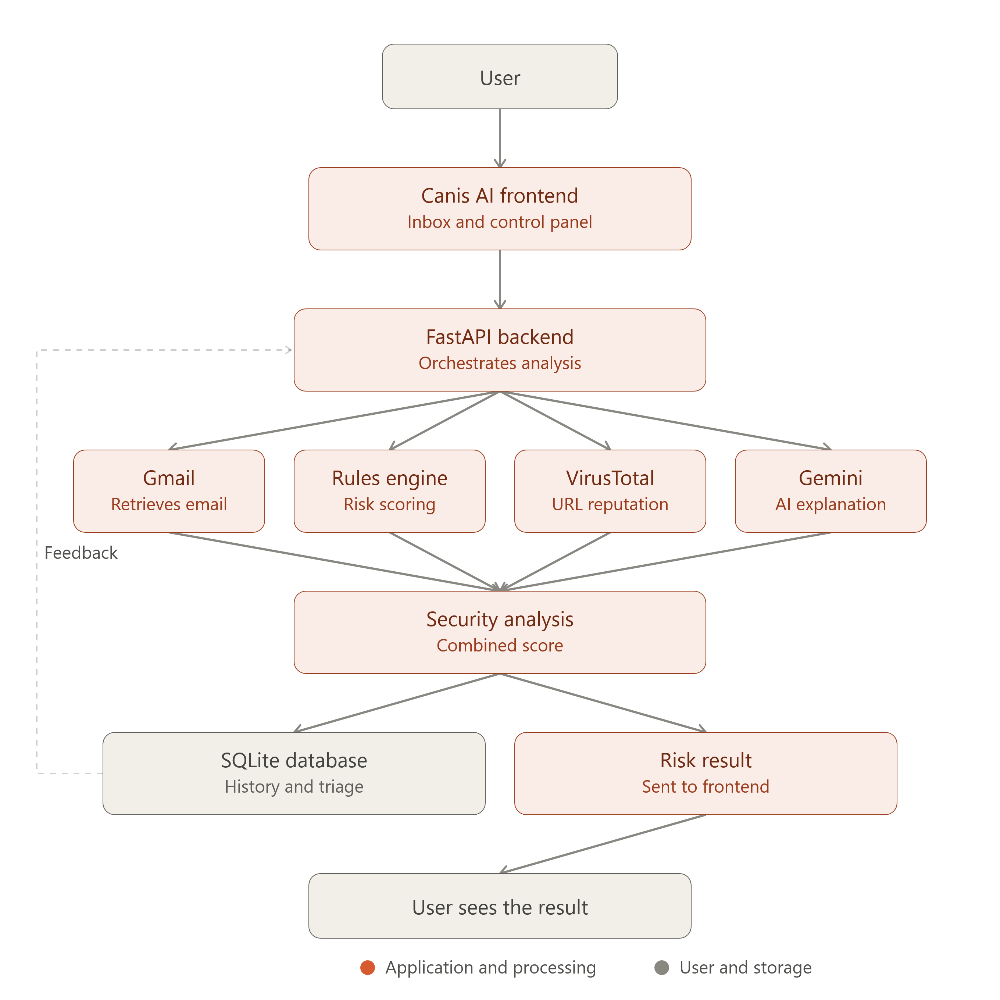
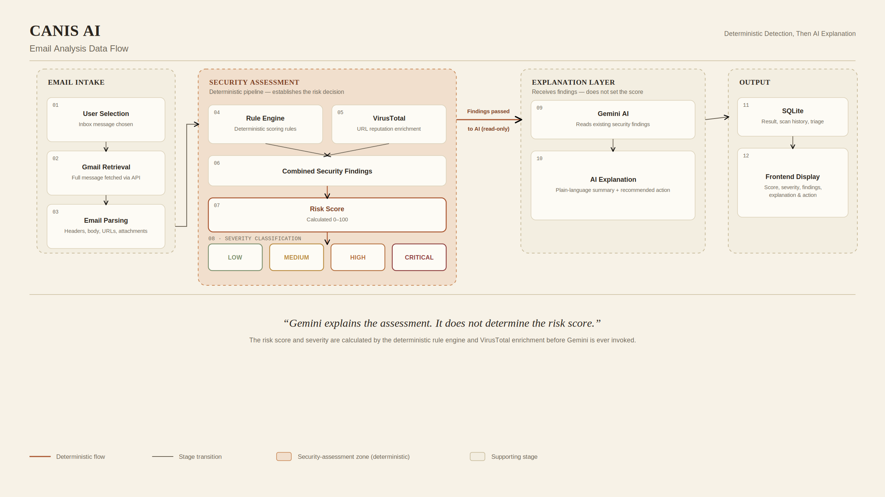

<h1>CANIS AI</h1>

<em>AI-Assisted Email Phishing Detection Platform</em>

Detect. Investigate. Understand.

 

---

## The Project

CANIS is an AI-assisted email security platform designed to help users investigate suspicious messages and assess phishing risk.

Rather than relying on a single detection mechanism, CANIS combines three complementary layers:

|        | Layer                   | Role                                               |
| :----: | :---------------------- | :------------------------------------------------- |
| **01** | **Rule Engine**         | Deterministic phishing indicators and risk scoring |
| **02** | **Threat Intelligence** | URL reputation analysis through VirusTotal         |
| **03** | **AI Explanation**      | Human-readable findings and recommended actions    |

The system produces a **0–100 risk score**, severity classification, supporting indicators, and an explanation for each analyzed email.

> **The AI does not determine the risk score.**
>
> The security assessment is established by deterministic analysis first. Gemini is then used to explain the resulting findings in a clear, human-readable way.

---

## Demonstration

### Cover Demonstration

*Click the image to open the demonstration video.*

### Full Interface Walkthrough

*Inbox → Dashboard → Logs*

*Click the image to open the full walkthrough.*

---

## Interface

### Inbox

The inbox retrieves recent Gmail messages and allows the user to select an email for analysis.

### Dashboard

The dashboard provides an overview of scan activity, severity distribution, and recent analysis results.

### Analysis Logs

The logs maintain a local record of completed analyses and user triage decisions.

---

## System Architecture

CANIS is divided into two primary components.

**Frontend**

A static HTML, CSS, and JavaScript interface responsible for authentication, inbox visualization, risk reports, dashboards, and triage interaction.

**Backend**

A Python/FastAPI service responsible for authentication, Gmail retrieval, analysis orchestration, threat intelligence, AI integration, and persistence.

The architecture separates the client interface, backend processing, external security services, and local persistence.

---

## Email Analysis Data Flow

When a user selects an email for analysis, CANIS processes the message through a structured security pipeline.

The deterministic rule engine establishes the primary assessment first. VirusTotal then provides additional URL intelligence. Only after the security findings have been established are they passed to Gemini for explanation.

This ordering prevents the language model from becoming the source of the primary security verdict.

---

## Detection Pipeline

When a user selects an email for analysis, CANIS performs the following sequence.

### 01 — Retrieve

The Gmail API provides message headers, body content, HTML content, links, and attachment names.

### 02 — Analyze

The deterministic rule engine evaluates common phishing indicators.

### 03 — Enrich

Extracted URLs are checked against VirusTotal for known malicious activity.

### 04 — Score

The findings are combined into a **0–100 risk score** and severity classification.

### 05 — Explain

Gemini receives the security findings and produces a plain-language explanation and recommended action.

### 06 — Store

The completed analysis is stored locally and returned to the frontend.

---

## Threat Intelligence

Links extracted from analyzed emails are checked against the VirusTotal threat-intelligence database.

A confirmed malicious result significantly increases the risk assessment.

A link with no malicious history is treated as **neutral rather than automatically suspicious**.

This distinction helps reduce false positives because legitimate newsletters and commercial emails frequently use third-party tracking, marketing, and redirect infrastructure.

---

## AI-Assisted Explanation

Once deterministic analysis and threat-intelligence enrichment are complete, CANIS sends the resulting findings to Google's Gemini API.

Gemini is instructed to:

* Explain the findings in plain language
* Work from the existing security findings
* Avoid independently determining the risk score
* Provide a recommended action
* Respond in the user's selected language

If the AI service becomes unavailable, CANIS still returns the deterministic assessment with a fallback message.

The AI therefore functions as an **explanation layer**, rather than the foundation of the security decision.

---

## Technology Stack

| Layer               | Technology                  | Purpose                                  |
| :------------------ | :-------------------------- | :--------------------------------------- |
| Backend             | **Python + FastAPI**        | API server and application orchestration |
| Frontend            | **HTML + CSS + JavaScript** | User interface                           |
| Database            | **SQLite**                  | Scan history and triage records          |
| Authentication      | **Google OAuth 2.0**        | Least-privilege Gmail authentication     |
| Email               | **Gmail API**               | Inbox retrieval and message parsing      |
| Threat Intelligence | **VirusTotal API**          | URL reputation analysis                  |
| AI                  | **Google Gemini API**       | Risk explanations and recommendations    |

---

## Security

Because CANIS processes real email data, security was incorporated directly into the application design.

### Least-Privilege Authentication

CANIS requests only:

gmail.readonly

The application can read Gmail messages but cannot send, delete, or modify them.

### CORS Protection

Cross-origin requests are restricted to the application's intended frontend origin.

### Input Validation

Triage actions are validated against an explicit allow-list before being stored.

### Secret Management

OAuth credentials and API keys are supplied through environment variables.

Secrets and the local database are excluded from version control through `.gitignore`.

### Error Handling

Unhandled backend errors return generic client-facing messages rather than exposing internal stack traces or filesystem paths.

---

## Interface Features

| Feature             | Description                               |
| :------------------ | :---------------------------------------- |
| Google OAuth        | Secure Gmail authentication               |
| Gmail Integration   | Real inbox message retrieval              |
| Phishing Analysis   | Deterministic security checks             |
| Risk Scoring        | 0–100 quantitative assessment             |
| Threat Intelligence | VirusTotal URL analysis                   |
| AI Explanation      | Human-readable security findings          |
| Recommended Actions | Guidance based on detected indicators     |
| Scan History        | Persistent local analysis records         |
| Dashboard           | Scan and severity statistics              |
| Triage Logging      | Local record of user decisions            |
| Themes              | Light and dark interface modes            |
| Localization        | Multi-language interface and explanations |

---

## Development

CANIS was developed incrementally, beginning with the backend analysis pipeline before the interface was implemented.

The development process included:

1. Google OAuth authentication
2. Gmail message retrieval
3. Deterministic rule engine
4. Gemini integration
5. Frontend implementation
6. Database-backed history
7. VirusTotal integration
8. Dashboard and triage functionality
9. Visual redesign
10. Multi-language support

Several engineering issues were encountered and resolved during development, including:

* OAuth PKCE code-verifier mismatches
* Migration from a deprecated AI SDK
* Changes in available AI models
* Rule-engine scoring inflation caused by repeated link-domain mismatch checks

The scoring issue was corrected so that the link-domain mismatch indicator is evaluated once per email rather than once per individual link.

---

## Known Limitations

CANIS is an MVP developed within an academic project scope.

Current limitations include:

* Session state is held in server memory
* No production-grade session expiration
* No rate limiting
* No CSRF protection
* SQLite is intended for local development rather than large-scale deployment
* The application is not intended to replace a commercial email security gateway

These controls would need to be strengthened before a public production deployment.

---

## Project Structure

canis-ai/
│
├── backend/
│   ├── ai_service.py
│   ├── auth.py
│   ├── database.py
│   ├── gmail_service.py
│   ├── main.py
│   ├── rule_engine.py
│   ├── virustotal_service.py
│   └── requirements.txt
│
├── frontend/
│   ├── assets/
│   │   ├── logo.png
│   │   ├── logo.svg
│   │   ├── screenshots/
│   │   │   ├── canis_ai_architecture_en.png
│   │   │   ├── canis_ai_dataflow_en.png
│   │   │   ├── canislogo.png
│   │   │   ├── dashboard.png
│   │   │   ├── inbox.png
│   │   │   └── logs.png
│   │   └── videos/
│   │       ├── cover-demo.mp4
│   │       └── inbox-dashboard-logs-demo.mp4
│   │
│   ├── dashboard.html
│   ├── dashboard.js
│   ├── inbox.html
│   ├── index.html
│   ├── script.js
│   ├── style.css
│   ├── theme.js
│   ├── threats.html
│   └── threats.js
│
├── .env.example
├── .gitignore
└── README.md

---

## Running Locally

### Clone the repository

git clone [https://github.com/merivalentine/canis-ai.git](https://github.com/merivalentine/canis-ai.git)
cd canis-ai

### Configure the environment

On Windows PowerShell:

Copy-Item .env.example .env

Add your own API credentials and OAuth configuration to `.env`.

**Do not commit `.env`.**

### Install dependencies

cd backend
pip install -r requirements.txt

### Start the backend

uvicorn main:app --reload

The frontend can be served separately as static files according to the local development configuration.

---

## Project Report

The accompanying technical report documents the system architecture, implementation decisions, security controls, development process, testing considerations, and known limitations.

---

## Purpose

CANIS was developed as a hands-on cybersecurity engineering project focused on:

* Phishing detection
* Threat intelligence
* Secure API integration
* Explainable security analysis
* Authentication
* Defensive application design

The project is intended for educational and research purposes.

---

 

<strong>CANIS AI</strong>

 

<em>AI-Assisted Email Phishing Detection Platform</em>

